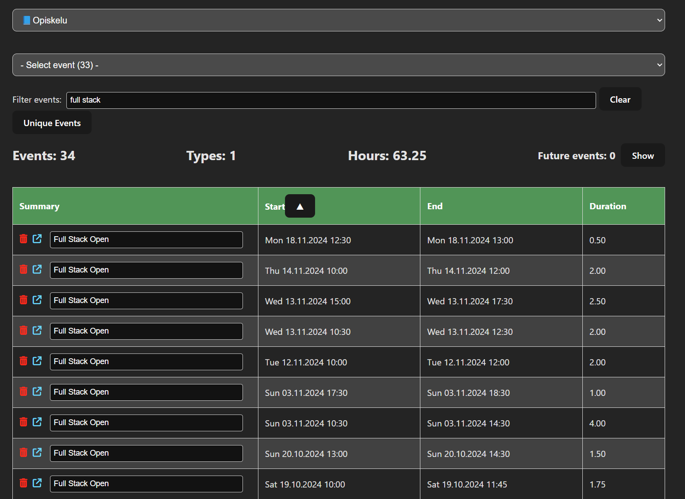

## Commands:

<p>To prevent conflicts in rules between ESLint and Prettier, and also to add linting of ES2015+ (ES6+) import/export syntax, let’s add the following plugins:</p>

```
npm install --save-dev eslint-config-prettier eslint-plugin-prettier eslint-plugin-import
```
- eslint-config-prettier: Turns off all ESLint rules that have the potential to interfere with Prettier rules.
- eslint-plugin-prettier: Turns Prettier rules into ESLint rules.
- eslint-plugin-import: Adds support for linting ES2015+ (ES6+) import/export syntax.

<br>
<p>Install the Airbnb ESLint config and the required plugins:</p>

```
npm init @eslint/config@latest
npm install --save-dev eslint-config-airbnb-base eslint-plugin-import
```

```
npm install
npm run backend
npm run dev
```

## Google Calendar API:

https://console.cloud.google.com/apis/api/calendar-json.googleapis.com/metrics?hl=fi&project=unique-acronym-406815

"When calling APIs that do not access private user data, you can use simple API keys. These keys are used to authenticate your application for accounting purposes. The Google Developers Console documentation also describes API keys.
Note: If you do need to access private user data, you must use OAuth 2.0. See Using OAuth 2.0 for Installed Applications, Using OAuth 2.0 for Server to Server Applications, and Using OAuth 2.0 for Web Server Applications for more information."

https://github.com/googleapis/google-api-python-client/blob/main/docs/api-keys.md

https://github.com/googleapis/google-api-python-client/blob/main/docs/start.md

## Changelog:

- v1.0 (24.11.2024): First version of the project.
  - List all calendars in the Google account.
  - Create, update, delete and list events in the table. 
  - Display all events in the calendar.
  - Display unique events in the calendar.
  - Option to filter out future events.

<br>
Filtered events listed on the table:

